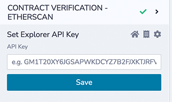
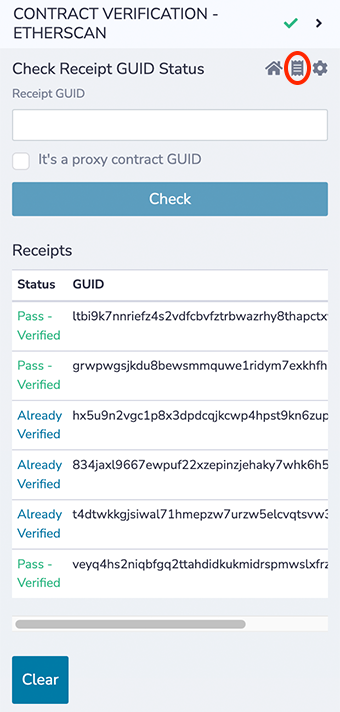
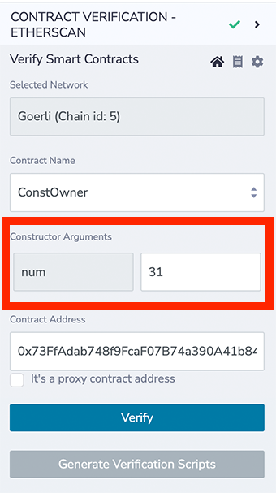
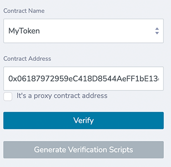
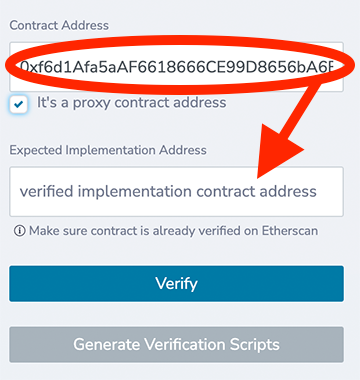
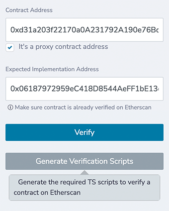
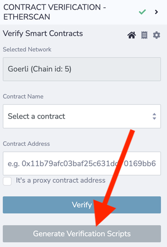

Contract Verification
====================

There are two contract verification services in Remix, Sourcify and Etherscan and the extended [Etherscan family](https://etherscan.io/eaas) of block explorers.

Sourcify
--------

Documentation about Sourcify is found [here]( https://docs.sourcify.dev/docs/how-to-verify/#remix-plugin).

Etherscan
---------

The Etherscan plugin is called: **CONTRACT VERIFICATION - ETHERSCAN**.

You can access it from the Plugin Manager.

The plugin has 3 pages, the **verification** page, the **receipts** page, and the **settings** page.

When you go to the plugin for the first time, the settings page will load for inputting the API key.

### Etherscan API Key - settings page
Etherscan is a block explorer for Ethereum mainnet and they make block explorers for other chains. 

For Ethereum testnets like Goerli or Sepolia, the same API key works. 

If you are trying to verify on L2 chains like Optimism, a different API key is needed for their block explorer. Not all of the block explorers made by Etherscan have API keys. The Remix Contract Verification - Etherscan plugin only works where you can login to that block explorer to get the API key.

Once the API key is input, the verification page (the homepage) is opened.

### Verification page

The network is NOT selected in the Etherscan plugin. The network is chosen in the Deploy & Run plugin and in your browser's wallet (if using). 

#### The prerequisites for verification are:
1. The address of a deployed contract on a public network
2. That same contract compiled in Remix
3. Constructor parameters same as used during deployment (if required)

### Receipts page
Verification receipts are found on the receipts page.

### Verification with constructor arguments
When a contract has arguments in the constructor, a text box will show for inputting the same constructor inputs as the deployed contract.

### Verifying a proxy contract
Before verifying a proxy contract, the associated implementation contract must already be verified. 

Just for review, the implementation contract is you wrote or adapted and the proxy is, for example, an ERC1967Proxy.

**Do not check the proxy box when verifying the implementation.**
Then after verifying the implementation contract:
1. Cut out the implementation contract's address from the Contract Address box.
2. Click the "It's a proxy contract address" checkbox.
3. Paste the verified implementation contract's address in the Expected Implementation Address box.
4. Paste in the proxy contract address into the Contract Address box.

To explain this visually, verify the implmentation contract:

Then check the "It's a proxy contract" checkbox and cut and paste the implementation address from the contract address to the implementation contract box:

And then paste the address of the proxy contract into the Contract Address box.

### Generate Verfication Scripts
Clicking the Generate Verification Scripts on the Verification page, will create a folder named etherscan in the Workspace's scripts folder that contains .ts files for verifying and returning the receipt status.

