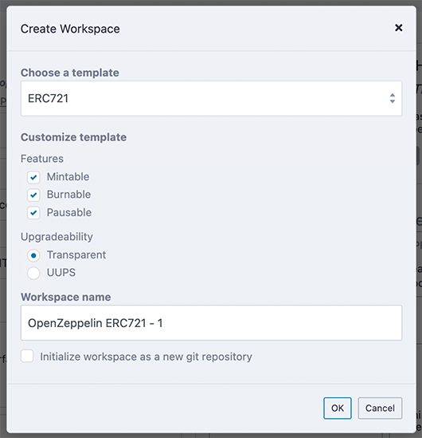
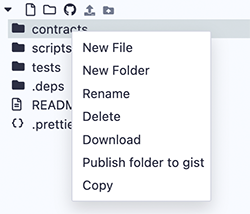
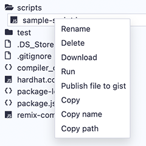

File Explorer
=============
The File Explorer is for managing Workspaces and files.  There is also a context menu that pops up when you right click on a file or folder.

To get to the File Explorer module - click the File Explorer icon.

The green checkmark at the top of the page means that this plugin is in the Remix codebase.  When you click on the caret it will show more info about the plugin including a link to this documentation.

File Storage
------------
By default, Remix IDE stores files in **IndexedDB**.  

Coding in Remix IDE Online is different from writing in a Google doc. 
- A Google doc saves your work to your account on Google’s servers.
- Remix has no user accounts.  By default, files are ONLY saved locally in the browser’s storage. So tread carefully, browser storage is not permanent!

See below for using other storage locations - notably **Remixd** to connect Remix to a specific folder on your hard drive.

**Important Note:** Clearing the browser storage & IndexedDB will **permanently delete** all the files stored there. 

### File Storage on your hard drive
If you want to store files on your computer's filesystem, use **[Remixd](remixd.html)** or use the **[desktop version of Remix IDE](https://github.com/ethereum/remix-desktop/releases/)**. 
- Remixd is a script that you run on your computer that shares a specified folder on your computer with Remix IDE.
- Remix Desktop is a version of Remix IDE in an Electron app. When using Remix Desktop, you cannot use a browser wallet like MetaMask, because Remix Desktop does not run in a browser.  You'd need to connect using a service like Infura.

### Connecting Remix to remote Git repos
**If you are not using Remixd, it is highly recommended that you save to a remote repo.** 
(Browsers do crash causing localstorage & indexedDB to be corrupted)

Remix IDE can be connected to remote Git repos both on services like GitHub or repos in IPFS.  
Most of the Git operations are done in the **DGIT** pluin. (DGIT stands for Decentralized GIT).

Branch management is also available at the bottom of the File Explorer when the Workspace is Git initialized.
(see this page for the Git workflow).

Also see this article about [securing your files in Remix](https://medium.com/remix-ide/securing-you-file-in-remix-how-to-clone-and-push-f1350111aa13?source=friends_link&sk=a3dbd0d3b0b44a29a28e8c10f8821fde)

Workspaces
------------

Workspaces in Remix are special folders that separate projects.  Files in one Workspace cannot be accesses from another Workspace.  Workspaces are selected using the Workspace select box.

#### New Workspaces
Workspaces are created by clicking the + button or by going to the hamburger menu in the upper right side of the File Explorer.

When making a new workspace, Remix offers the following templates: 

- Blank
- Remix Default
- Open Zeppelin ERC20
- Open Zeppelin ERC721
- Open Zeppelin ERC1155
- 0x Project ERC20
- Gnosis MultiSig

When choosing an Open Zeppelin template, additional functionality can be added.

#### Workspace operations

The Workspace hamburger menu is for operations that work on an entire workspace.

##### Clone
When clicking Clone, you’ll be asked for the url of a remote repo. A new workspace will be created that will contain the cloned repo. To manage the Git repo, go to the DGIT plugin.
##### Backup
Backup is for downloading all the Workspaces in a .zip file. The zip file will have a folder called **.workspaces** that will contain a folder of each Workspace.  Depending on your OS, you may need to change the preferences on .workspaces folder to make it visible.  

##### Restore
Restore is only for uploading a .workspaces folder that was created using the Backup operation.

##### Create GitHub Actions
The Workspace operations to create **Solidity Test Workflow**,  **Moca Chai Test Workflow**, and **Slither Workflow** are for creating GitHub actions. When clicked, a .yml file in the .workflows folder of the active Workspace.

### Workspaces initialized with Git
Workspaces with an associated Git will have the Git icon next to them in the Workspaces select box.

When creating a new Workspace, there is a checkbox in the modal for choosing the template that will initialize the Workspace for Git.

Working with Files
-------------------
When a file is clicked on it will appear in the Editor.

Files can be manipulated by right clicking on them ([see below](#right-click-on-a-file-or-folder)) and also by using the icons under the Workspace select box.

- **A.** Create a file   
- **B.** Create a folder   
- **C.** Publish all the file in this Workspace to a GIST 
- **D.** Upload a file into the current Workspace 
- **E.** Upload a folder into the current Workspace 

## Creating new files

There are 2 ways of creating files:  
- The first is to click on the new file icon (**H.** in fig.1), then an input for the new file’s name will appear in the **File Explorer**. Once a name is entered, a new empty file will open in the Editor.  If the file's name is entered **without** a file extension, the extension **.sol** will be appended by default.

- The second way of creating a file is to right click on a file or folder to get a popup menu.

The new file will be placed in **the currently selected folder** of the Workspace. If a file and not a folder is selected, then the new file will be placed in that file’s folder. And if nothing is selected, then the file will be placed in the root of the current workspace's folder. Or to be brief — just be mindful of what folder it lands in.

Publish to Gist
---------------

The icon (marked **J.** in fig.1) publishes all files from the current Workspace to a gist. **The Gist API requires users to be authenticated** to be able to publish a gist.  

Click [this link](https://github.com/settings/tokens) to Github tokens setup and select Generate new token. Then check the **Create gists** checkbox and generate a new token. Also make sure you check the box to enable the creation of Gists with this token.

Take the token and paste it in Remix's **Settings** module in the **Github Access Token** section. And then click Save.

You can also publish by right clicking on the file or folder.

Right-Click on a File or Folder
-------------------------------

Right-clicking on a file or folder will bring a context menu — where you can create a folder or file within the same folder or to delete, rename, or publish the file or folder. 

The functionality of the context menu also works with RemixD (which gives you have access to a folder on your hard drive).  

**Note:** When working with RemixD, and when adding files to the shared folder from your computer (and not from Remix), you'll need to open and close the containing folder or switch in and out of **localhost** workspace to refresh the view.

Right-Click Menu
---------------------
### Right-Click on a Solidity file

Right-clicking on a file with a .sol extension will bring up an expanded context menu - which will also let you compile & flatten a file.

### Right-Click on a Script

Right-click on any file with a .js or .ts extension to get the **Run** option in the context menu to run the script.  The **Run** in the context menu is a shortcut.  The other way to get a script to run is to:
1. Click on the script to make it the active tab in the editor 
2. Input the command `remix.exeCurrent()` in the console.
