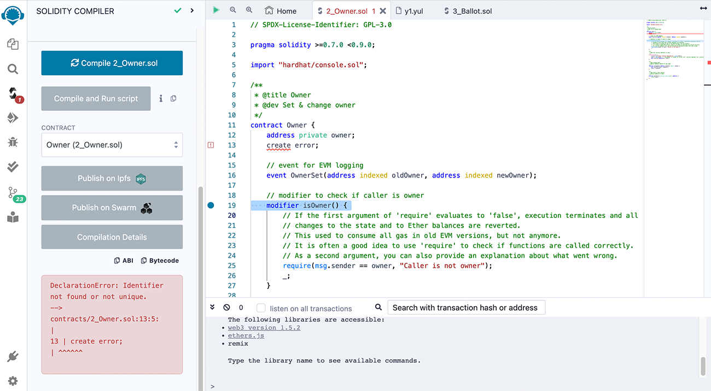
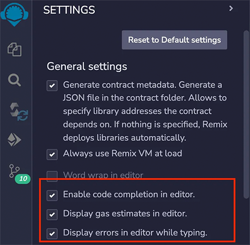
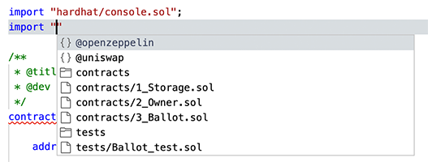
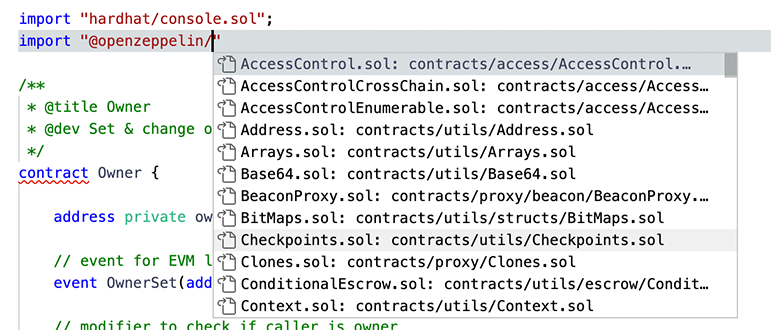
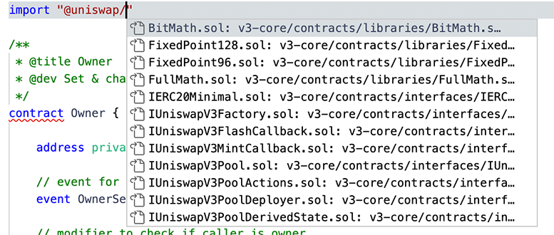
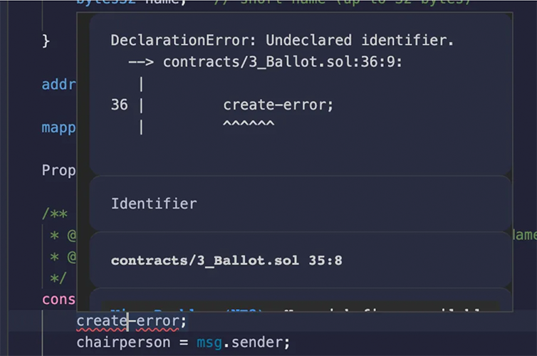
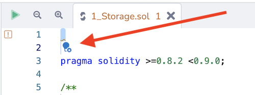
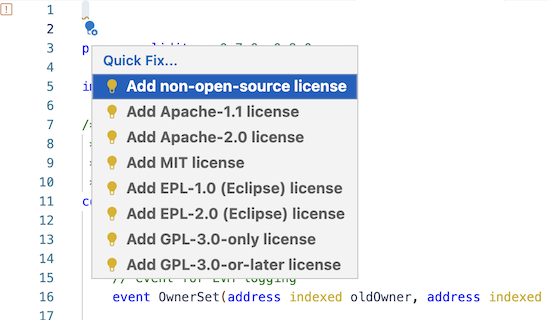
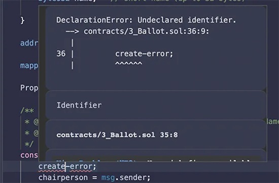

Editor
===============

- Remix uses the Monaco editor. This is the same editor used by VSCode.
- Remix saves the current file every 5 seconds. 
- The Remix Editor will highlight keywords in Solidity, JS, and TS.

## Editor displays information from other plugins
The main purpose of the Editor is, of course, to edit code. But it also works with other plugins, notably, the Solidity Compiler and the Debugger. 

- The Solidity Compiler will display warnings and errors in the Editor's gutter at the problematic line.
- Breakpoints for the Debugger are input in the Editor's gutter. 
- When stepping through code in the Debugger, the relevant code will be highlighted in the Editor.

## General Operations
Files are open as tabs. When there are too many tabs to display, scrolling with a mouse wheel will horizontally scroll the tabs.

- The Play button works on the active tab. If a Solidity file is active, clicking Play will compile it. If a TS or JS file is active, Play will run the script.
- The magnifying glass icons (+/-) on the top left corner are to increase/decrease the font size.
- The small type on the far right of the Editor is clickable to jump to a section.

## TypeScript

The Editor and Script Runner support TypeScript, which means that you can write TypeScript, have some auto-completion, and run it straight from Remix. As stated above, there is syntax highlighting in TS.

The default Workspace contains example TypeScript files.

## Editor & Autocompile
When autocompile is enabled (in the Settings panel), compilation will occur each time the current file is changed, or another file is selected. 

## Autocomplete 
Autocompleting Solidity code happens when you start typing in the Editor. The Compiler will run in the background, and process any imports you have. You will see these imports appear in the .deps directory in the File Explorer.

**Tip:** If you start with a Solidity file that contains errors, the Compiler might not be able to compile it. In that case, the Editor's autocomplete features will not fully work until after the file is successfully compiled. After that, autocomplete will work even if there are errors, but only for the elements the Compiler already understands. For example, if you add a new function in a file that contains errors, autocomplete will not be able to find that function because it can’t compile the file. 

## Auto complete on imports
The Editor's autocomplete will offer the option to bring in OpenZeppelin contracts, Uniswap contracts, and the paths to all the files in the current Workspace.

So, when choosing @openzeppelin, you’ll get this:

And the same with Uniswap:

## Errors and Warnings
You can tell the file was successfully compiled if no errors or warnings are displayed in the Editor. Errors are displayed using squiggly lines. A red line indicates an error, a yellow line is a warning.

Hovering over the squiggly line shows you the message from the Compiler.

Tabs and the File Explorer will also will also display whether a file contains errors or warnings.

#### Errors on Imported Files

A file with errors in one of the files that it imports will also trigger an error in the Editor. Your main file might not compile, but you will see there is a problem immediately.

### Hovering over an Error Number in the File Explorer
The number of errors in a file is also reported in the File Explorer. Hovering over the number, which indicates the amount of errors/warnings, will display the information from the Compiler.

## Quick Fixes for commonly forgotten code
The Remix editor offers solutions to the following missing code:
- License
- Pragma
- Visibility
- Mutability
- Data Location (storage, memory, etc)
- Add virtual or override
- Marking a contract abstract

In the image below, the license has been left out.  After compilation, a warning is triggered and a blue dot appears. 

When you click on the blue dot, there are a few options:

If you can’t get the Quick Fix blue dot to appear, try clicking on the number for the line where the error occurs.

## Gas Estimates

Gas estimates are displayed on the same line where a function is declared. 

Constructor gas estimates are also displayed, and consist of two components: creation cost and code deposit cost.

## Go to Definition and References

### Definitions
By right-clicking, you can go to a definition. You can also use the shortcut displayed.

You can also right-click on the filename of an import statement and jump to that file.

You can also ‘peek’ at the definition inline in the Editor. You can then jump to a definition by double-clicking on the right hand side of the line.

### References
By right-clicking, you can display all the references. You can also use the shortcut displayed.

You can jump to a reference by double-clicking on the right hand side of the line.

## Highlighted References

References are highlighted in the Editor.

## Hovering

When you hover over a term with a definition, the definition will pop up. Hovering over code that has triggered an error (underlined with a red squiggly line) will show the error message.

## Files with Errors turn Red

When a file contains an error, its name will turn red, both in the File Explorer and on its tab at the top of the Editor.

More about the Editor updates in this article: Major Updates to Remix Editor

